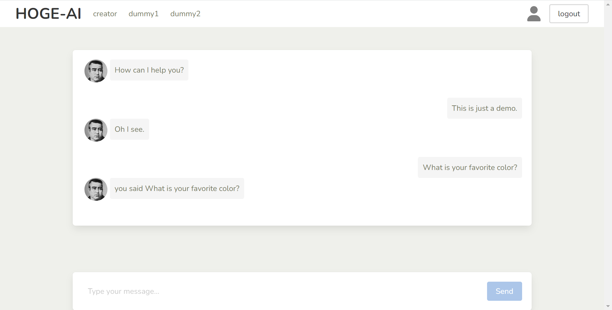

# Chatbot-UI sample by bulma & nuxt3

:thumbsup: you can use npm / yarn instead of pnpm, of course!

## setup

```bash
pnpm install
```

## launch

```bash
pnpm run dev
```

Start the development server on `http://localhost:3000`



## features

this sample includes:

- font-awesome
- google-font
- mock chatbot stream response (word by word)
  => see [server/api/mock.post.js](/server/api/mock.post.js)
- mock login/logout

## format

```bash
pnpm run format
```

## refs

[Nuxt 3 documentation](https://nuxt.com/docs/getting-started/introduction)


## license
This project is licensed under the [MIT license](/LICENSE.md), Copyright (c) 2023 Hitoshi Wada.
